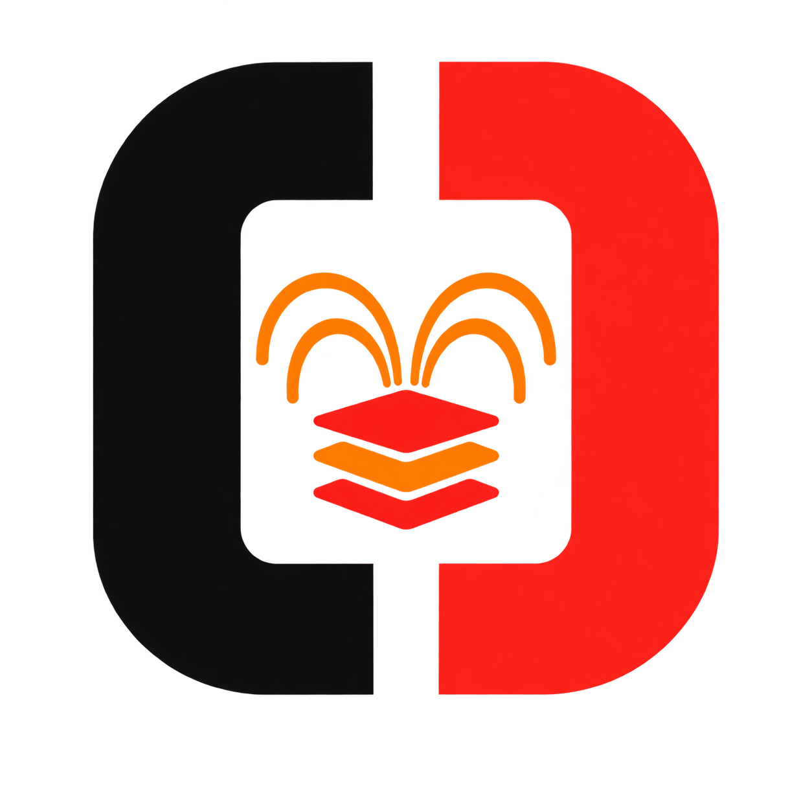
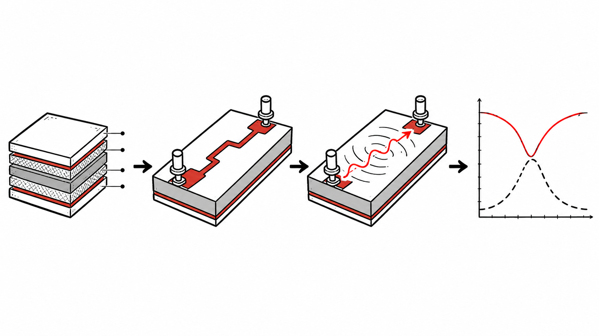

<p align="center">
  <strong>English</strong> · <a href="README.zh-CN.md">简体中文</a>
</p>

# AnsysEM Agent Bridge

<p align="center">
  
</p>

<p align="center"><strong>From stackup, geometry, and ports to a solved native report—without using the original project as a scratchpad.</strong></p>

<p align="center">
  <a href="https://pypi.org/project/ansysem-agent-bridge/"></a>
  <a href="https://pypi.org/project/ansysem-agent-bridge/"></a>
  <a href="https://github.com/cottman99/ansysem-agent-bridge/actions/workflows/ci.yml"></a>
  <a href="LICENSE"></a>
</p>



## Finish an HFSS 3D Layout build-to-report task

> “Start from an empty project, build this stackup and trace, place two edge
> ports, solve 1–5 GHz, export S11/S21, and leave the plot ready in AEDT.”

| Model built and reopened in AEDT | Native result left in the project |
| --- | --- |
|  |  |

The public AEDT 2026 R1 acceptance completed the full path:

- created an empty HFSS 3D Layout project;
- added two materials and the GND / SUB / TOP stackup;
- created a ground plane, signal trace, P1 / P2, and Setup1;
- solved five explicit frequencies from 1 to 5 GHz;
- exported finite S-parameter data to CSV and persisted the native Report;
- closed and freshly reopened the project before acceptance.

Both captures are native AEDT application windows. The model view was replayed
after acceptance from the same public typed build contract, outside the timed
test; the result plot is the persisted AEDT Report from the solved acceptance.

AnsysEM Agent Bridge connects Codex or Pi Agent to one exact AEDT project and
design. It can inspect existing work, build the maintained stackup/geometry/port
families, solve explicit sweeps, and apply known layout or bondwire changes on
protected candidates. Local and SSH work use
[EDA Bridge Runtime](https://github.com/cottman99/eda-bridge-runtime), so long
jobs, retries, timing, and audit follow the same path.

New PyAEDT uses do not require one new Bridge wrapper per method. The Agent
combines version-matched official docs with a small packaged experience library,
then runs official code through a governed project transaction with source
fingerprint, timeout, fresh reopen, and validation. Existing build, solve, and
model operations remain as asset-bound compiled shortcuts that reduce tokens
and transcription risk without limiting broader official API reach.

## Start with an explicit AEDT installation

Install on the AEDT host:

```console
pipx install ansysem-agent-bridge
ansysem-agent --pretty doctor
```

Installing the package automatically installs its compatible
`eda-bridge-runtime` Python dependency. You do not need to install a second
Python package by hand. If the Agent runs on another computer, enable the
Runtime MCP/plugin on the Agent host; the AEDT-only host does not need the
Agent-facing plugin.

Configure one exact AEDT installation instead of silently selecting the newest:

```console
ansysem-agent --pretty setup \
  --aedt-root /path/to/AnsysEM/v261 \
  --version 2026.1 \
  --docs-root /path/to/private/local/docs
```

For live work, an administrator pins the matching Python, display, and module
environment once in a named
[runtime profile](docs/EXECUTION_CONTEXT_CONTRACT.md). Engineers then select
the project/design in AEDT or paste the Context copied by the installed add-in
and describe the task naturally.

## What you can ask your Agent

| Natural-language request | What the Bridge checks |
| --- | --- |
| “Which AEDT installation and design am I using?” | Resolves explicit version, project, design, editor, process, host, display, and profile identity. |
| “Inspect this project before changing anything.” | Verifies the complete project bundle and returns bounded object, port, setup, and revision facts. |
| “Find the version-matched API for this operation.” | Queries private local documentation and returns focused evidence without launching or mutating AEDT. |
| “Export a top view of this exact layout.” | Uses the native editor export and labels precisely what the image does and does not prove. |
| “Change this variable in the design I am watching, but do not save yet.” | Reuses the exact live AEDT process selected by Context, checks the prior value, applies one typed variable edit, reads it back, and leaves save or discard explicit. |
| “Start from a blank project: build this stackup and trace, place the two edge ports, and add a 1–5 GHz setup.” | Uses a typed material/stackup/geometry/port plan, protects the empty source, and requires fresh PyEDB and AEDT readback. |
| “Run these five frequencies, export S11/S21 to CSV, and leave the S-parameter plot ready in AEDT.” | Creates an explicit named sweep, waits for the solve, checks every numeric point, exports CSV, creates a native report, and freshly reopens the solved project. |
| “Apply these known layout or bondwire changes.” | Uses typed operations on a copy, then saves, closes, freshly reopens, and runs exact assertions. |
| “Keep adjusting this candidate; do not create another customer version yet.” | Reuses one candidate workspace with checkpoints, rollback, and idempotent patches. |
| “Promote the checked candidate to a new deliverable.” | Replays from the frozen source and commits one immutable output only after final fresh-session checks. |
| “The connection dropped. Did my AEDT job finish?” | Reads the durable receipt and events without replaying the work. |

See the [capability matrix](docs/CAPABILITY_MATRIX.md) for the exact maintained
support and stop rule behind each capability.

## A safer model-update workflow

1. Select or copy the exact AEDT project/design Context.
2. For supervised small changes, reuse that live GUI session and keep, save, or
   discard explicitly.
3. For unattended or high-risk work, begin one task candidate from the frozen
   source and batch compatible edits into typed patches.
4. Freshly reopen before accepting a durable checkpoint.
5. Promote once, only when the user asks for a deliverable.

This avoids both dangerous in-place edits and the opposite failure mode of
creating a permanent project version for every small correction.

For a one-shot, fully known change:

```console
ansysem-agent --pretty --profile <profile-id> \
  model apply --plan /path/to/operation-plan.json --redact-paths
```

For iterative work, use the [candidate workspace lifecycle](docs/WORKSPACE_LIFECYCLE.md).
Task-specific object names and values stay in project-local plans; they do not
enter the public Bridge, Skill, or tests.

## Evidence beyond the screenshot

A maintained real-host acceptance path covers AEDT 2026 R1 on Linux, including
exact installation/display identity, project creation and inspection, durable
jobs, non-overwriting workspaces, fresh reopen, typed assertions, and artifact
hashes. See the
[sanitized AEDT 2026 R1 acceptance](docs/VALIDATION_AEDT_2026R1_LINUX.md).

The maintained build-to-report acceptance starts from an empty HFSS 3D Layout
project, creates a synthetic three-layer two-port layout, solves an explicit
five-point sweep, exports exact CSV data, creates the native AEDT report, and
finds the same results after a fresh reopen. See the
[sanitized workflow evidence](docs/VALIDATION_2026-08-30_HFSS3DLAYOUT_WORKFLOW.md).

The native report above is useful visual evidence, but a screenshot alone does
**not** prove electrical correctness, mesh, convergence, or solver completion.
The maintained acceptance additionally checks the exact project bundle,
ports, setup, five finite frequency rows, exported CSV, solver artifacts, and
the same report after a fresh reopen.

## The AEDT Context add-in

The lightweight Automation-tab add-in provides:

- **Use Current Design with Agent**
- **Copy Agent Context**
- **Agent Connection Status**

The copied Context carries a secret-free host-local locator, software identity,
display label, design target, freshness, and capability hints. Exact private
paths remain on the AEDT host. Context selects a target; it never grants
permission to mutate or solve.

See the [execution context contract](docs/EXECUTION_CONTEXT_CONTRACT.md) for
the exact identity model.

## Local and remote use follow one path

Repeated operations on the AEDT host use:

```console
ansysem-agent runtime serve
```

Runtime keeps one local or SSH transport, records each concise purpose and
timing partition, and persists long-job receipts before AEDT work starts.
Projects, documentation, and artifacts stay on the EDA host unless the user
deliberately exports a sanitized result. If Agent and AEDT share one computer,
register a local connection and still use Runtime so retry, audit, and evidence
behavior remain identical.

## Safety boundary

- no implicit newest-version or foreground-window guessing;
- no claim based on a lone `.aedt` file when an HFSS 3D Layout bundle is required;
- no arbitrary Python in the default public operation surface;
- no source overwrite and no accepted mutation before fresh reopen;
- no permanent version for each candidate attempt;
- no blind GUI coordinates and no screenshot-only success;
- no force-kill or silent discard of modified work;
- no claim that documentation, visibility, or image export proves a solve;
- no customer projects, private paths, or vendor documentation in this public repository.

## Next

- governed access to version-matched official PyAEDT/PyEDB/native APIs so new
  documented uses do not require one Bridge wrapper per geometry, port, solver,
  or report feature;
- richer substrate, parameterized-model, field, mesh, convergence, extraction,
  optimization, and reporting journeys selectively promoted as certified
  workflows.

## More information

- [Capability and evidence matrix](docs/CAPABILITY_MATRIX.md)
- [Operation classification](docs/OPERATION_CLASSIFICATION.md)
- [Candidate workspace lifecycle](docs/WORKSPACE_LIFECYCLE.md)
- [Execution context contract](docs/EXECUTION_CONTEXT_CONTRACT.md)
- [Architecture](docs/ARCHITECTURE.md)
- [Release contract](docs/RELEASE_CONTRACT.md)
- [Security policy](SECURITY.md)
- [Sanitized Linux acceptance](docs/VALIDATION_AEDT_2026R1_LINUX.md)
- [Sanitized HFSS 3D Layout build-to-report acceptance](docs/VALIDATION_2026-08-30_HFSS3DLAYOUT_WORKFLOW.md)
