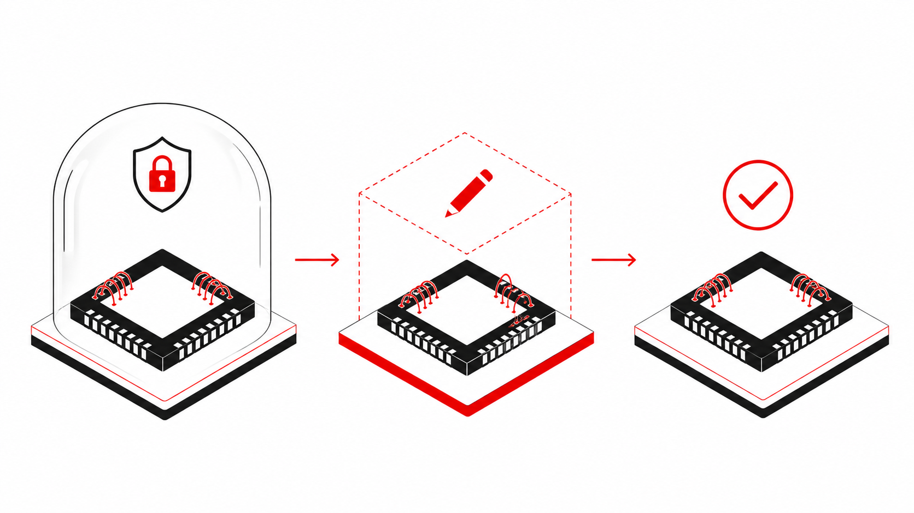

<p align="center">
  <strong>English</strong> · <a href="README.zh-CN.md">简体中文</a>
</p>

# AnsysEM Agent Bridge

<p align="center">
  
</p>

<p align="center"><strong>Let your Agent inspect and change the intended AEDT design without using the original project as a scratchpad.</strong></p>

<p align="center">
  <a href="https://pypi.org/project/ansysem-agent-bridge/"></a>
  <a href="https://pypi.org/project/ansysem-agent-bridge/"></a>
  <a href="https://github.com/cottman99/ansysem-agent-bridge/actions/workflows/ci.yml"></a>
  <a href="LICENSE"></a>
</p>



AnsysEM Agent Bridge is an unofficial, local-first bridge for Ansys Electronics
Desktop. It gives general-purpose Agents such as Codex and Pi Agent a stable
way to identify the exact project and design, inspect live HFSS 3D Layout state,
make bounded changes on non-overwriting copies, and return evidence-bearing
artifacts.

The Bridge keeps AEDT knowledge and native API behavior on the EDA host.
Repeated local or SSH work passes through
[EDA Bridge Runtime](https://github.com/cottman99/eda-bridge-runtime), so long
jobs, retries, timing, and audit follow one path.

> [!IMPORTANT]
> This project is public alpha software and is not affiliated with or endorsed
> by Ansys, Inc. Begin with a disposable project and review the capability
> boundary before using it on important work.

## Start with an explicit AEDT installation

Install on the AEDT host:

```console
pipx install ansysem-agent-bridge
ansysem-agent --pretty doctor
```

Installing the package automatically installs its compatible
`eda-bridge-runtime` Python dependency. You do not need to install a second
Python package by hand. If the Agent runs on another computer, enable the
Runtime MCP/plugin on the Agent host; the AEDT-only host does not need the
Agent-facing plugin.

Configure one exact AEDT installation instead of silently selecting the newest:

```console
ansysem-agent --pretty setup \
  --aedt-root /path/to/AnsysEM/v261 \
  --version 2026.1 \
  --docs-root /path/to/private/local/docs
```

For live work, an administrator pins the matching Python, display, and module
environment once in a named
[runtime profile](docs/EXECUTION_CONTEXT_CONTRACT.md). Engineers then select
the project/design in AEDT or paste the Context copied by the installed add-in
and describe the task naturally.

## What you can ask your Agent

| Natural-language request | What the Bridge checks |
| --- | --- |
| “Which AEDT installation and design am I using?” | Resolves explicit version, project, design, editor, process, host, display, and profile identity. |
| “Inspect this project before changing anything.” | Verifies the complete project bundle and returns bounded object, port, setup, and revision facts. |
| “Find the version-matched API for this operation.” | Queries private local documentation and returns focused evidence without launching or mutating AEDT. |
| “Export a top view of this exact layout.” | Uses the native editor export and labels precisely what the image does and does not prove. |
| “Apply these known layout or bondwire changes.” | Uses typed operations on a copy, then saves, closes, freshly reopens, and runs exact assertions. |
| “Keep adjusting this candidate; do not create another customer version yet.” | Reuses one candidate workspace with checkpoints, rollback, and idempotent patches. |
| “Promote the checked candidate to a new deliverable.” | Replays from the frozen source and commits one immutable output only after final fresh-session checks. |
| “The connection dropped. Did my AEDT job finish?” | Reads the durable receipt and events without replaying the work. |

See the [capability matrix](docs/CAPABILITY_MATRIX.md) for the exact maintained
support and stop rule behind each capability.

## A safer model-update workflow

1. Select or copy the exact AEDT project/design Context.
2. Inspect the live identity and source bundle.
3. Begin one task candidate from the frozen source.
4. Batch compatible edits into typed patches.
5. Save, close, and freshly reopen before accepting each checkpoint.
6. Promote once, only when the user asks for a deliverable.

This avoids both dangerous in-place edits and the opposite failure mode of
creating a permanent project version for every small correction.

For a one-shot, fully known change:

```console
ansysem-agent --pretty --profile <profile-id> \
  model apply --plan /path/to/operation-plan.json --redact-paths
```

For iterative work, use the [candidate workspace lifecycle](docs/WORKSPACE_LIFECYCLE.md).
Task-specific object names and values stay in project-local plans; they do not
enter the public Bridge, Skill, or tests.

## Evidence, not screenshots as proof

A maintained real-host acceptance path covers AEDT 2026 R1 on Linux, including
exact installation/display identity, project creation and inspection, durable
jobs, non-overwriting workspaces, fresh reopen, typed assertions, and artifact
hashes. See the
[sanitized AEDT 2026 R1 acceptance](docs/VALIDATION_AEDT_2026R1_LINUX.md).

A native layout export proves only that AEDT exported the named live editor
state. A visible object or screenshot does **not** prove electrical correctness,
mesh, convergence, or solver completion. Solver claims require separate solver
evidence.

## The AEDT Context add-in

The lightweight Automation-tab add-in provides:

- **Use Current Design with Agent**
- **Copy Agent Context**
- **Agent Connection Status**

The copied Context carries a secret-free host-local locator, software identity,
display label, design target, freshness, and capability hints. Exact private
paths remain on the AEDT host. Context selects a target; it never grants
permission to mutate or solve.

See the [execution context contract](docs/EXECUTION_CONTEXT_CONTRACT.md) for
the exact identity model.

## Local and remote use follow one path

Repeated operations on the AEDT host use:

```console
ansysem-agent runtime serve
```

Runtime keeps one local or SSH transport, records each concise purpose and
timing partition, and persists long-job receipts before AEDT work starts.
Projects, documentation, and artifacts stay on the EDA host unless the user
deliberately exports a sanitized result. If Agent and AEDT share one computer,
register a local connection and still use Runtime so retry, audit, and evidence
behavior remain identical.

## Safety boundary

- no implicit newest-version or foreground-window guessing;
- no claim based on a lone `.aedt` file when an HFSS 3D Layout bundle is required;
- no arbitrary Python in the default public operation surface;
- no source overwrite and no accepted mutation before fresh reopen;
- no permanent version for each candidate attempt;
- no blind GUI coordinates and no screenshot-only success;
- no force-kill or silent discard of modified work;
- no claim that documentation, visibility, or image export proves a solve;
- no customer projects, private paths, or vendor documentation in this public repository.

## More information

- [Capability and evidence matrix](docs/CAPABILITY_MATRIX.md)
- [Candidate workspace lifecycle](docs/WORKSPACE_LIFECYCLE.md)
- [Execution context contract](docs/EXECUTION_CONTEXT_CONTRACT.md)
- [Architecture](docs/ARCHITECTURE.md)
- [Release contract](docs/RELEASE_CONTRACT.md)
- [Security policy](SECURITY.md)
- [Sanitized Linux acceptance](docs/VALIDATION_AEDT_2026R1_LINUX.md)
